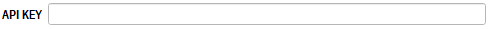
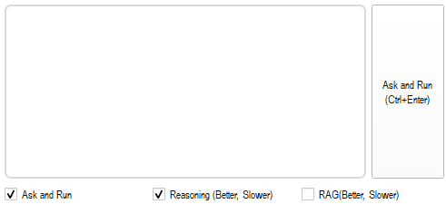

한국어 | [English](README_eng.md)

 

<h1 align="center">
 👋 QGIS에 AI를 더하다, <b>QueryGIS</b>
</h1>

    

<aside>

### **📢 Chat-Bot🤖과 대화를 통해 QGIS에 명령을 내릴 수 있는 플러그인 QueryGIS의 베타테스터를 모집합니다‼️**

 

</aside>

## 💁개요

**QueryGIS는 Chat-Bot🤖과의 대화를 통해 QGIS에 명령을 내릴 수 있는 플러그인 입니다.** 🙌

✅ QGIS 초보자의 공간정보 접근 편의성 향상이 가능합니다.

✅ 단순 반복 작업 명령을 사용하는 실무자의 업무 효율을 극대화합니다.

✅ QGIS의 모든 기능을 숙지하지 않아도 Chat-Bot 과 대화를 통해 기능 사용이 가능합니다.

 

### **🎬 시연 영상**

    이미지를 클릭해주세요. 👇

    

 

## 🗒️목차

- [👋 QGIS에 AI를 더하다, **QueryGIS**](#-qgis에-ai를-더하다-querygis)
- [💁 개요](#-개요)
  - [🎬 시연 영상](#-시연-영상)
- [📢 베타테스터 모집](#-베타테스터-모집)
  - [📅 신청 기한](#-신청-기한)
  - [📩 신청 방법](#-신청-방법)
  - [✅ 신청 자격](#-신청-자격)
  - [💰 비용 안내](#-비용-안내)
- [🛠️ 설치](#-설치)
- [🚀 사용](#-사용)
  - [⚠️ 사용 시 주의사항](#-사용-시-주의사항)
  - [🗒️ 사용 방법](#-사용-방법)

 

## 📢베타테스터 모집

### 📅 **신청 기한**

- **2025.03.31 까지**
- 기한 이후 신청 시 아래 메일로 문의 바랍니다.

### 📩 **신청 방법**

- `juseonglee99@3dlabs.co.kr` 로 문의
- 문의 시 아래 정보를 작성 바랍니다:
    
    - 소속
    - 이름
    - 직급
    - 이메일
    - 전화번호 (선택)
    

### ✅ **신청 자격**

- 없음 (학생 / 직장인 모두 가능)
- 단, 베타테스트 설문조사 및 실행결과표 작성에 동의해야 함

### 💰 **비용 안내**

- **베타테스트 신청 및 기타 비용은 100% 무료입니다.**
- 테스트 중 발생하는 비용은 **(주)쓰리디랩스**가 부담합니다.

**📢문의 사항이 있으시면 아래 이메일로 연락 바랍니다.**

> 문의 이메일 : `juseonglee99@3dlabs.co.kr`
> 

 

## 🛠️ 설치

플러그인 사용을 위해서는 제공되는 플러그인의 압축 파일(.zip)을 다운로드 한 후 설치하는 절차가 필요합니다.

1️⃣ **`[플러그인] - [플러그인 관리 및 설치] - [ZIP 파일에서 설치]`** 탭에서 다운로드 한 압축 파일을 설치합니다.

2️⃣ 설치 후 플러그인 툴바 내 아이콘을 선택하여 플러그인 패널을 생성합니다.

 

## 🚀 사용

플러그인 사용 방법에 대해 설명합니다. QGIS 3.12 이상 버전인 경우 공통적인 방법으로 설치 및 사용이 가능합니다.

### ⚠️사용 시 주의사항

- 실시간으로 API를 사용하고 있어 인터넷 연결이 필수적이며, 연결 환경 및 OpenAI 측 서버 문제로 인해 문제가 발생할 수 있습니다.
- Response 가 오기까지 충분한 시간이 필요할 수 있습니다.
- 원하는 동작이 수행되지 않을 시 다음 사항들을 확인 바랍니다.
    - ‘이 레이어’를 지시하였을 시 원하는 레이어를 선택(클릭) 한 상태인가?
    - 레이어의 이름을 정확히 명시하였는가?
    - 좌표계가 올바르게 설정되어 있는가?
    - QGIS 내에서 사용할 수 있는 기능인가?
    

### 🗒️사용 방법

- 제공되는 API key를 입력합니다.

    

- Query를 입력하고 Ask (Ctrl + Enter) 버튼을 클릭합니다.
    - `Ask and Run` 기능이 기본으로 설정되어있습니다. 즉시 실행을 원하지 않는다면 해제해주십시오.
    - `Reasoning (Better, Slower)` 선택 시 추론 모델인 o3-mini 로 동작됩니다.
    - `RAG (Better, Slower)` 선택을 통해 더 정확하고 신뢰성 있는 답변을 받을 수 있습니다.

    

 

    

    <a href="https://www.3dlabs.co.kr/kor/main/main.html" width="100" height="auto">🌐3DLabs HP</a>

