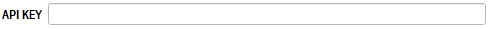
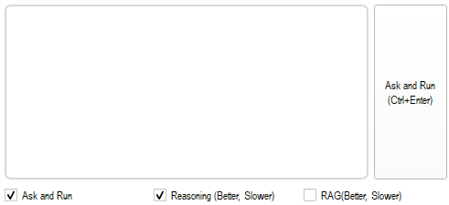

한국어 | [English](README_eng.md)

# QueryGIS

**Turn Natural Language into Real QGIS Workflows**

QueryGIS는 QGIS를 위한 AI 인터페이스로, GIS 분석가, 연구자, 원격탐사 실무자, 기관/조직이 의도(intent)에서 실행(execution)까지 더 자연스럽고 효율적으로 이동하도록 돕습니다.

## Product Snapshot

QueryGIS helps you interact with QGIS in plain language, generate actionable GIS steps, and accelerate spatial analysis without constant trial-and-error scripting.

- Official launch target: **Q2 2026 (by June 30, 2026)**
- Early beta participation: `juseonglee99@3dlabs.co.kr`

## Trust Signals

- AI Champion Top 20
- TTA Award Winner
- Built for QGIS Workflows
- Natural Language GIS Interface

## What QueryGIS Does

QueryGIS는 메뉴 탐색, 단편적인 문서 검색, 취약한 스크립트 반복에 의존하던 흐름을 줄이고, 자연어 기반으로 더 직관적인 QGIS 작업 방식을 제공합니다.

- **Natural Language Interaction**  
  평문으로 작업을 설명해 GIS 워크플로우 진입 장벽을 낮춥니다.
- **Actionable GIS Guidance**  
  모호한 아이디어를 분석/시각화/데이터 처리 단계로 구체화합니다.
- **Faster QGIS Workflows**  
  반복 작업을 줄이고 의도에서 실행까지의 시간을 단축합니다.

### Example Workflows

## Why It Matters

QGIS는 강력하지만, 많은 작업이 여전히 높은 학습 비용, 반복적인 스크립팅, 과도한 도구/문서 탐색을 요구합니다. QueryGIS는 이 장벽을 낮춰 더 접근 가능하고 반복 가능한 지리공간 작업 환경을 제공합니다.

## Award & Recognition

QueryGIS was recognized in the 2025 AI Champion competition, advancing into the Top 20 among 630 participating teams and receiving the Korea Information and Communication Technology Association Award (TTA Award).

이 성과는 QueryGIS의 기술적 완성도와 실무 적용 가능성을 함께 보여줍니다.

- **630** Participating Teams
- **Top 20** Finalist Ranking
- **TTA Award** Official Recognition

## Demo

- YouTube: https://www.youtube.com/watch?v=yjNUj8UkJz0

## Built for Real Geospatial Tasks

- **Spatial Analysis**: 버퍼, 오버레이, 선택 기반 분석, 고밀도 분석 업무
- **Raster & Remote Sensing**: 다단계 래스터 처리 및 전처리
- **Visualization & Styling**: 지도 표현, 레이어 스타일링, 카토그래피 품질 향상
- **Workflow Acceleration**: 반복 클릭/수작업 감소, 일상 업무 속도 향상

## Education & Consulting

각종 공간정보 관련 기관/대학교 대상 AI 기반 GIS 입문 및 활용 교육을 운영하고 있으며, 조직의 AI 전환을 위한 컨설팅을 함께 진행합니다.

- GIS + AI Foundation Training
- Institutional Workshops
- AI Transition Consulting

## Installation

플러그인 사용을 위해 제공되는 `.zip` 파일을 내려받아 설치합니다.

1. `플러그인 > 플러그인 관리 및 설치 > ZIP 파일에서 설치`
2. 설치 후 툴바 아이콘으로 패널 실행

## Usage

1. 제공된 API key 입력
2. Query 입력 후 `Ask (Ctrl + Enter)` 실행
3. `Ask and Run`은 기본 활성화 상태이므로 필요 시 해제

## Contact

- Beta / 교육 / 컨설팅 문의: `juseonglee99@3dlabs.co.kr`
- GitHub: https://github.com/hongbumm/QueryGIS
- 3DLabs: https://www.3dlabs.co.kr/kor/main/main.html
