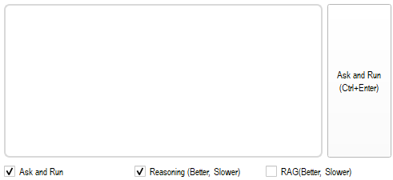
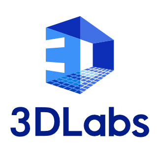

# README_eng

[한국어](README.md) | English

## 👋 **Bringing AI to QGIS: QueryGIS**

<aside>
📢

**Join the Beta Testers for QueryGIS, a Plugin that Allows You to Command QGIS via Chat-Bot‼️**

</aside>

## 💁Overview

---

**QueryGIS is a Plugin that Allows You to Command QGIS via Chat-Bot! 🤖**🙌

✅ Improve the ease of access to spatial information for QGIS beginners.

✅ Maximizes work efficiency for professionals using simple, repetitive commands.

✅ Operate its functions through conversations with a Chat-Bot without mastering every feature of QGIS.

### **🎬 Demo Video**

[https://www.youtube.com/watch?v=x31T7725Njs](https://www.youtube.com/watch?v=x31T7725Njs)

## 🗒️  **Table of Contents**

---

## 📢 Beta Testing

---

### 📅 **Application Deadline**

- **~ 2025.03.31**
- For inquiries after the deadline, please contact us via email below.

### 📩 **How to Apply**

- Contact us at `juseonglee99@3dlabs.co.kr`
- Please include the following details in your inquiry:
    
    > - Affiliation
    > 
    > 
    > - Name
    > 
    > - Position
    > 
    > - Email
    > 
    > - Phone Number (Optional)
    > 

### ✅ **Eligibility**

- No restrictions – open to students and professionals alike.
- However, participants must agree to complete the beta test survey and execution report.

### 💰 **Cost Information**

- **The beta test and all related costs are 100% free.**
- Any costs incurred during testing will be covered by **3DLabs.**

**📢 For any inquiries, please contact us at the email below.**

> email : `juseonglee99@3dlabs.co.kr`
> 

## 🛠️ Installation

---

To use the plugin, you need to download the provided **compressed file (.zip)** and then install it.

1️⃣ In the **`[Plugins] - [Manage and Install Plugins] - [Install from ZIP]`** tab, install the downloaded compressed file.

2️⃣ After installation, click the icon in the plugin toolbar to open the plugin panel.

## 🚀 Usage

---

Here’s an explanation of how to use the plugin. For QGIS version 3.12 or later, you can install and use it by following a common procedure.

### ⚠️ Precautions

- Since the API operates in real-time, an internet connection is required. Issues may occur due to your connection environment or problems on OpenAI’s servers.
- It may take some time for a response to arrive.
- If the desired action is not performed, please check the following:
    - ‘When instructing “this layer,” have you selected (clicked) the intended layer?
    - Have you specified the layer's name correctly?
    - Is the coordinate system set correctly?
    - Is it a function that can be used within QGIS?

### 🗒️ How to Use

- Enter the provided API key.

- Enter your query and click the Ask (Ctrl + Enter) button.
    - `Ask and Run` function is enabled by default. If you do not want immediate execution, please disable it.
    - Selecting `Reasoning (Better, Slower)` will operate using the reasoning model, o3-mini.
    - Choosing `RAG (Better, Slower)` allows you to receive more accurate and reliable responses.

[🌐3DLabs HP](https://www.3dlabs.co.kr/kor/main/main.html)